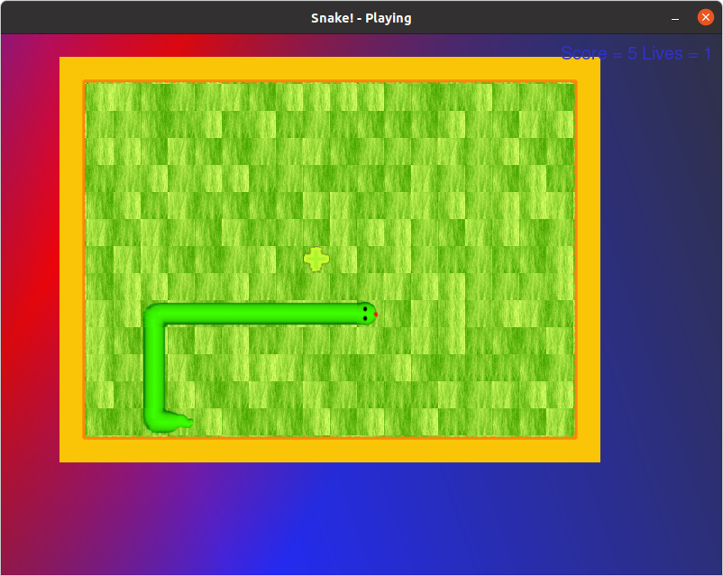

# Introduction

This program is a simple snake game. I made it when I was learning to program, back in 2010. In fact, it is my first, ever, programming project (beyond simple _helloworld_ programs).

Originally, it was kept on Dropbox, but now I decided to recover it from there and host it on GitHub.

It's quite a quirky game, but I am proud of it and fondly remember making it. Here is a screenshot from the simple gameplay.



# Running from Source Code

This game was written in Python 2. To run the game from the source code, execute the following commands to install `pygame` locally with _virtualenv_. These steps are known to work on Ubuntu 20.04.

```bash
virtualenv venv
. venv/bin/activate
pip install -r requirements.txt
python snake.py
```

# Building AppImage

The game can be distribuited in the AppImage format. For this, the `appimage-builder` build tool is needed - which in turn needs `patchelf`. To install these two commands, run the following installation commands.

```bash
sudo apt install patchelf
sudo pip3 install appimage-builder
```

Now, to build the distribution image, simply invoke the builder command.

```bash
appimage-builder
```

Now, a new file, named `green-snake-1.0.0-x86_64.AppImage` should have appeared in the current directory.
